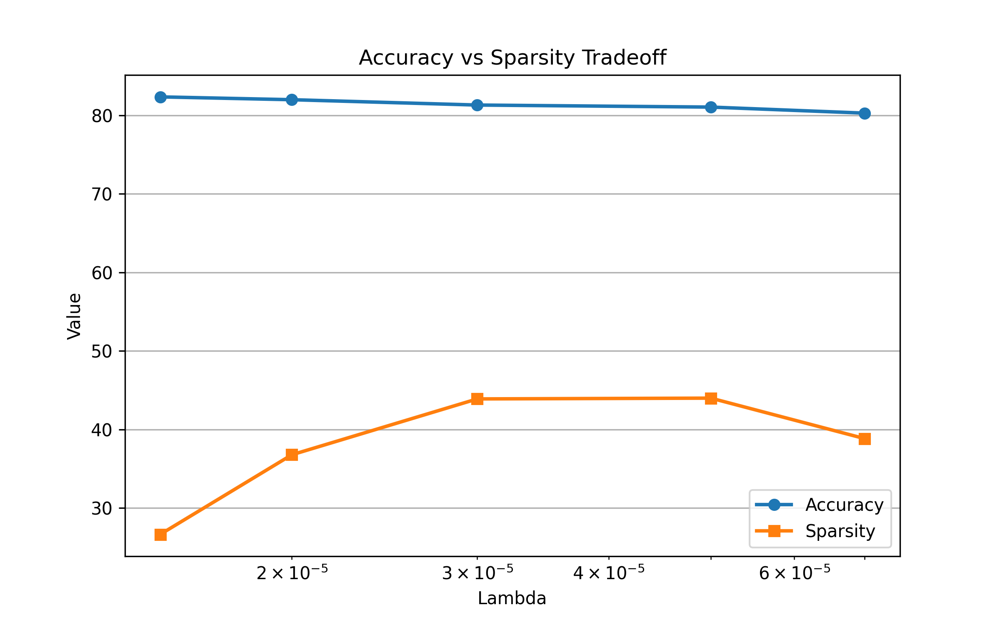

# Self-Pruning Neural Network for Dynamic Sparse Learning

A production-style PyTorch implementation of a neural network that **learns to prune its own connections during training** using differentiable gate parameters.

Built as a case study submission for the **Tredence AI Engineering Internship**.

---

## Candidate Details

**Name:** V Krishnakumar
**Register Number:** RA2311026020074
**Email:** [kv4553@srmist.edu.in](mailto:kv4553@srmist.edu.in)

---

# Project Objective

Traditional neural network pruning is usually performed after training:

1. Train dense model
2. Remove low-importance weights
3. Fine-tune again

This project introduces a **Self-Pruning Neural Network** that learns sparse connectivity during training itself.

The model jointly learns:

* classification accuracy
* connection importance
* compressed architecture
* efficiency vs performance tradeoff

---

# Core Innovation

Each weight is paired with a learnable gate.

Effective weight:

```text
W_pruned = W × sigmoid(score / temperature)
```

Where:

* `W` = original weight
* `score` = learnable gate parameter
* `temperature` = controls gate sharpness

If the gate approaches zero, the connection is effectively removed.

---

# Model Architecture

## CNN Feature Extractor

```text
Input (32x32x3)
↓
Conv(32) → ReLU → MaxPool
Conv(64) → ReLU → MaxPool
Conv(128) → ReLU → MaxPool
```

## Sparse Classifier Head

```text
PrunableLinear(2048 → 256)
ReLU
Dropout
PrunableLinear(256 → 10)
```

---

# Loss Function

Total Loss:

```text
CrossEntropyLoss + λ × L1(Gates)
```

Where:

* CrossEntropy learns classification
* L1 penalty encourages sparse gate activations
* λ controls pruning strength

---

# Engineering Enhancements

## Temperature Annealing

Soft gates early, sharper pruning later.

```text
Epoch 1: T = 4.0
Final Epoch: T = 0.7
```

## Additional Improvements

* Lambda sweep for best sparsity-performance tradeoff
* Cosine learning rate scheduling
* Checkpoint saving
* Reproducible experiments with fixed seeds

---

# Experimental Results (Real Runs)

| Lambda | Test Accuracy | Sparsity % |
| ------ | ------------- | ---------- |
| 1.5e-5 | 82.35%        | 26.63%     |
| 2e-5   | 81.99%        | 36.77%     |
| 3e-5   | 81.31%        | 43.88%     |
| 5e-5   | 81.05%        | 43.98%     |
| 7e-5   | 80.28%        | 38.82%     |

---

# Best Balanced Model

```text
81.05% CIFAR-10 Accuracy
43.98% Learned Sparsity
```

This demonstrates that the model can remove nearly half its effective connections while preserving strong predictive performance.

---

# Accuracy vs Sparsity Tradeoff



---

# Gate Value Distribution


---

# Key Insights

## Strong Feature Extraction Matters

Initial MLP baseline underperformed. Upgrading to a CNN backbone significantly improved accuracy.

## Sparse Learning Works

Gate distributions showed many gates collapsing toward zero.

## Tradeoff is Controllable

Lambda directly adjusts the balance between compression and accuracy.

---

# Repository Structure

```text
self-pruning-neural-network/
│── train.py
│── model.py
│── evaluate.py
│── utils.py
│── config.py
│── requirements.txt
│── README.md
│
├── outputs/
│   ├── results.csv
│   ├── tradeoff.png
│   ├── gate_histogram.png
│
├── checkpoints/
│   ├── model_lambda_1.5e-05.pth
│   ├── model_lambda_5e-05.pth
│
└── report/
    └── case_study_report.md
```

---

# How to Run

## Install Dependencies

```bash
pip install -r requirements.txt
```

## Train Models

```bash
python train.py
```

---

# Why This Project Matters

Dynamic sparse networks are relevant for modern AI systems because they reduce:

* inference latency
* memory usage
* compute cost
* deployment footprint

Applications include:

* edge AI
* scalable inference systems
* sparse expert routing
* low-cost production models

---

# Future Extensions

* Transformer attention head pruning
* Quantization + pruning hybrid
* Reinforcement learned sparsity
* Mixture-of-Experts sparse routing
* FastAPI inference deployment

---

# Tech Stack

* Python
* PyTorch
* Torchvision
* NumPy
* Pandas
* Matplotlib
* FastAPI

---

# Final Summary

This project demonstrates an end-to-end AI engineering workflow involving:

* custom neural layer design
* training system implementation
* hyperparameter optimization
* efficiency-aware evaluation
* reproducible experimentation

It reflects practical AI engineering focused not only on accuracy, but also deployability and computational efficiency.

---

# Author

**V Krishnakumar**
AI / Full Stack / Systems Builder
